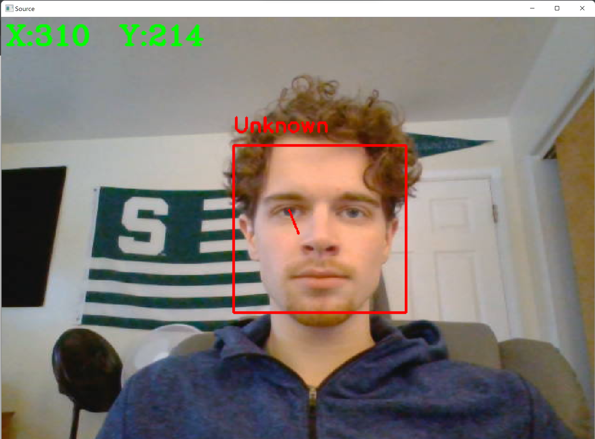
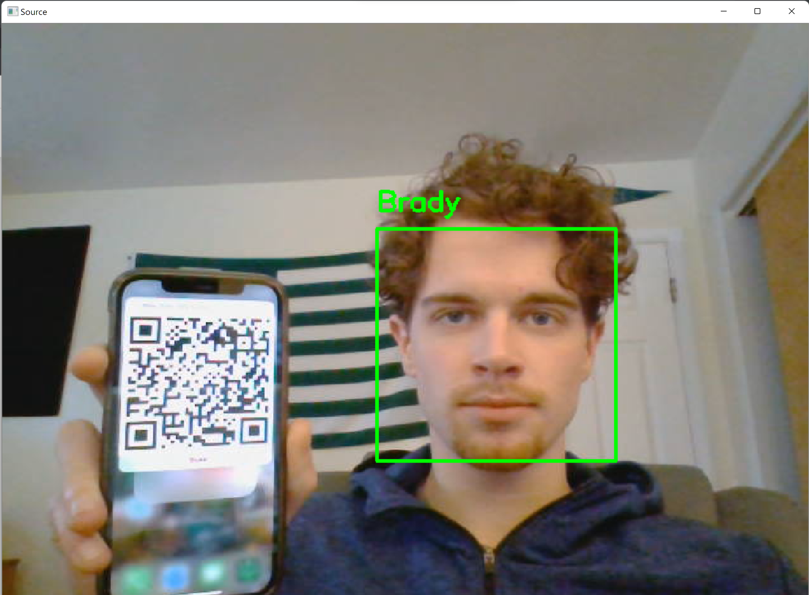
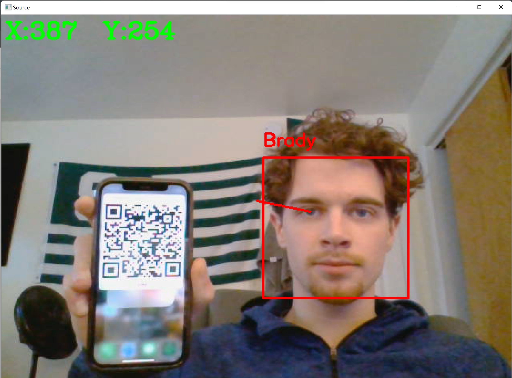
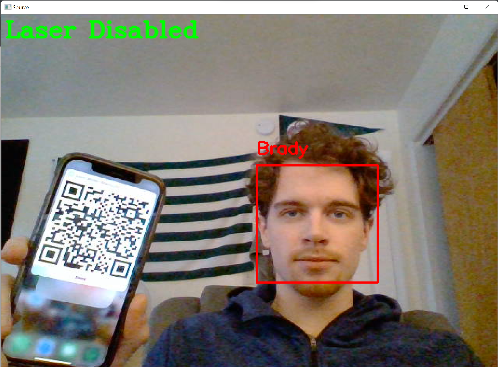

# QRControlledFacialRecognition
A facial recognition program controlled by QR codes produced from ios shortcuts.

On the iOS side, the shortcuts encode a string with a hased password and time as well as the data required to reform the command.
When a code it read by the program, it checks that the password is correct and the time stamp is within the last 15 seconds.
The encoded data is then parsed and passed to the program.

## The QR codes allow the following functions:
- [Add user (allows to specify authorization)](https://www.icloud.com/shortcuts/2bf8eca27e92450db21591b15c81a3a9)
- [Change Name](https://www.icloud.com/shortcuts/a217139bd11e4558b486bda270663b61)
- [Change Authorization](https://www.icloud.com/shortcuts/5493ac5c9d7848a6aea308e01e26870f)
- [Pause/Resume Laser Mode (see below)](https://www.icloud.com/shortcuts/97f221b0ea9a4f9db150676221eb3e8d)

## Examples
### 1. On Program Run

By default, no one is recognized and laser mode is enabled. The red box signifies the person is not authorized, and laser mode is
shown by the red line from the center of the screen to the right eye.  
>*Laser mode was designed to work with an accompanying project to implement this software as a security system that points a laser in the eye of an entruder*

### 2. User added

A user is added by presenting the QR code with the face in the same frame.

### 3. Change Authorization

Another command can be given to change the authorization of a known person. Here, laser mode is enabled.

### 4. Disable Laser

When laser mode is pasued, the program does not attempt to locate the eye of those not authorized.
